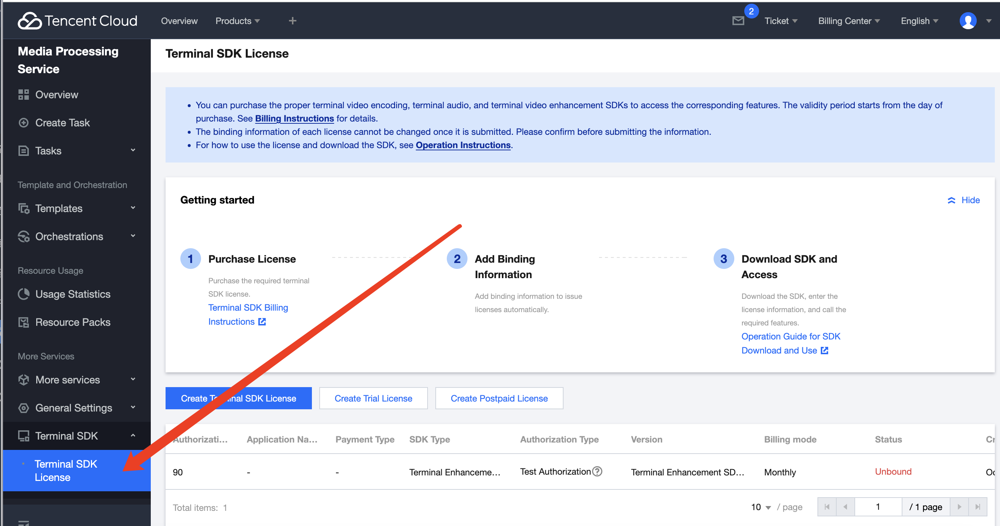

## 组件简介

FTUIPlayerKit Flutter Plugin 是基于原生组件 [TUIPlayerKit](https://cloud.tencent.com/document/product/881/96685) 封装的 flutter 版本 TUI 短视频组件，支持视频极速首帧和流畅滑动，提供优质播放体验的短视频组件。

## 集成步骤

### 环境准备

- Android 系统最低版本要求：Android SDK  >= 21
- IOS 系统最低版本要求：iOS version >= 12
- Flutter SDK 版本：>= 3.3.0

### 播放器高级版License 配置

TUI 短视频属于播放器高级能力，需要使用移动端播放器高级版 License。

播放器高级版 License 申请指引如下：

- 腾讯云中国站客户：

使用 TUIPlayer Kit 组件需要使用移动端播放器高级版 License，您可参见 [移动端播放器 License]() 指引来获取。若您已获取对应 License，可前往 [腾讯云视立方控制台 > License 管理 > 移动端 License](https://console.cloud.tencent.com/vcube/mobile) 获取对应 LicenseURL 和 LicenseKey。如果没有申请移动端播放器高级版 License，将会出现视频播放失败、黑屏等现象。

- 腾讯云国际站客户：

使用 TUIPlayer Kit 组件需要使用移动端播放器高级版 License，您可参见 [移动端播放器 License](https://www.tencentcloud.com/document/product/266/51098#mobilelicense) 指引来获取。若您已获取对应 License，可前往 [云点播控制台 > License 管理 > 移动端 License](https://console.tencentcloud.com/vod/license) 获取对应 LicenseURL 和 LicenseKey。如果没有申请移动端播放器高级版 License，将会出现视频播放失败、黑屏等现象。

获取对应 LicenseURL 和 LicenseKey后，可以通过下面实例代码配置 Liecense：

```dart
FTUIPlayerConfig config = FTUIPlayerConfig(
    licenseUrl: LICENSE_URL,
    licenseKey: LICENSE_KEY);
FTUIPlayerKitPlugin.setTUIPlayerConfig(config);
```

### Native 层依赖 SDK 更新和配置

#### Android 端

Android 端依赖原生 TUIPlayerKit 的本地aar，最新正式版可在 [Android TUIPlayerKit](https://cloud.tencent.com/document/product/881/96685) 进行下载。
于 `./android/libs` 目录中进行替换

#### iOS 端

IOS 端依赖原生 TUIPlayerKit 的本地xcFramework，最新正式版可在 [IOS TUIPlayerKit](https://cloud.tencent.com/document/product/881/96686) 进行下载。
于 `./ios/` 目录中进行替换

*此外还需要在自身 ios 项目中进行本地 podspec 引入*
在自身项目 podfile 中的主要 Target 下，添加如下 pod 依赖

```text
  # :path must replace to your sdk's path
  pod 'TUIPlayerShortVideo/Player_Premium' ,:path => '../../ios/TUIPlayerShortVideoSDK/'
  pod 'TUIPlayerCore/Player_Premium' ,:path => '../../ios/TUIPlayerCoreSDK/'
```

*path路径需要替换为您下载的 TUIPlayerKit IOS SDK 所在的目录*

## 本地超分配置指引

FTUIPlayerKit 的超分使用的腾讯云的 [TSR 超分](https://github.com/tencentyun/TSR)。

#### Android 端SDK授权申请

具体授权所需信息请[点击这里](https://github.com/tencentyun/TSR/blob/main/Android%20%E6%8E%A5%E5%85%A5%E6%8C%87%E5%8D%97.md#111-%E6%8E%88%E6%9D%83%E6%89%80%E9%9C%80%E4%BF%A1%E6%81%AF) ，然后可以连续腾讯云客服提供对应的 sdk。

#### iOS 端SDK授权申请

具体授权所需信息请[点击这里](https://github.com/tencentyun/TSR/blob/main/iOS%20%E6%8E%A5%E5%85%A5%E6%8C%87%E5%8D%97.md#111-%E6%8E%88%E6%9D%83%E6%89%80%E9%9C%80%E4%BF%A1%E6%81%AF)，然后可以连续腾讯云客服提供对应的 sdk。

#### 开通MPS控制台

为了服务能够正常授权，您还需要在腾讯云官网开通【媒体处理（MPS）控制台】。

中国站开通链接：https://console.cloud.tencent.com/mps。

国际站开通链接：https://console.tencentcloud.com/mps/client_sdk/license。



超分套餐资费，请联系您的商务。

#### Android 端超分配置指引

1. 将 plugin_monet-release-x.x.x.aar 和 TsrSdk-Release-x.x.x.aar 2 个 aar 集成到项目中，其中TsrSdk-Release-x.x.x.aar 是您提供超分授权信息后获得的超分 SDK， 而 plugin_monet-release-x.x.x.aar 使用 github 项目中的即可。

   

2. App工程添加权限

   ```xml
    <uses-permission android:name="android.permission.INTERNET"/>
   
    //如果 Android targetSdkVersion 大于等于 31，需要添加以下标签，否则专业版功能无法使用
    <application>
    <uses-native-library android:name="libOpenCL.so" android:required="false"/>
    </application>
   ```


3. 设置混淆规则

​	在 proguard-rules.pro 文件中，将 SDK 相关类加入不混淆名单：

```java
-keep class com.tencent.** { *; }

```

#### iOS 端超分配置指引

1. 将sdk 目录下 TXCMonetPlugin 和 tsrClient 两个库引入到自身目录中，随后在自身项目中进行本地集成。其中 tsrClient 是您提供超分授权信息后获得的超分 SDK， 而 TXCMonetPlugin 使用 github 项目中的即可，以下代码为 cocoasPod 本地集成示例:
```objectivec
pod 'TXCMonetPlugin' ,:path => '../../ios/TXCMonetPlugin/'
pod 'tsrClient' ,:path => '../../ios/tsrClient/'
```
2. 在 Xcode 中，项目的 `General` 标签下，找到 `Framework,Libraries,and Embedded Content` 分栏，添加 `CoreML.framework`,如下图示例：


#### 超分运行指引

**注意：请确保运行时使用的签名证书与申请超分时提供的信息一致，否则超分会授权失败。**

1. 初始化设置超分信息

   其中 appId, authId 是腾讯云签发的授权信息，srAlgorithmType 是超分算法类型，枚举值参考 FTXMonetConstant

   ```dart
   // 其中 appId, authId 是腾讯云签发的授权信息
   FTUIPlayerKitPlugin.setMonetAppInfo(${appId}, ${authId}, FTXMonetConstant.SR_ALGORITHM_TYPE_STANDARD);
   ```

2. 通过FTUIPlayerVodStrategy#enableSuperResolution 开启超分配置

   ```dart
   FTUIPlayerVodStrategy _myVodStrategy = FTUIPlayerVodStrategy();
   // 通过策略配置,开启超分
   _myVodStrategy.enableSuperResolution = true; 
   _shortPlayerController.setVodStrategy(_myVodStrategy);
   ```

   

## 使用指引

1. 创建 TUI 短视频对象

```dart
FTUIPlayerShortController _shortPlayerController = FTUIPlayerShortController();
```

2. 加载数据

```dart
_shortPlayerController.setModels(sources);
```

加载数据之后，sdk 内会对视频资源做预处理操作

3. 根据项目需求设置点播策略

```dart
_shortPlayerController.setVodStrategy(FTUIPlayerVodStrategy());
```

4. 在 PageView 或者其他Page 组件中，集成绑定和预创建操作

页面创建示例代码：
```dart
itemBuilder: (context, index) {
            // Prevent duplicate creation
            WeakReference<ShortVodItemControlView>? cacheView = _playerViews[index];
            ShortVodItemControlView itemControlView;
            if (null == cacheView || null == cacheView.target) {
              FTUIPlayerView playerView = FTUIPlayerView();
              itemControlView = ShortVodItemControlView(playerView, sources[index]);
              _playerViews[index] = WeakReference(itemControlView);
            } else {
              itemControlView = cacheView.target!;
            }
            if (_isSetModeled && index == 0) {
              _isSetModeled = false;
              onPageChanged(index);
            } else {
              _shortPlayerController.preCreateVodPlayer(itemControlView.playerView, index);
            }
            return itemControlView;
          })),
```

页面发生变动示例代码：
```dart
void onPageChanged(int index) async {
    ShortVodItemControlView itemControlView = getFTUIPlayerView(index);
    _currentVodController = await _shortPlayerController.bindVodPlayer(itemControlView.playerView, index);
    itemControlView.playerController = _currentVodController;
    // start play after binding
    await _shortPlayerController.startCurrent();
}
```

## 接口描述

### FTUIPlayerKitPlugin

#### setTUIPlayerConfig

配置当前 TUI 短视频所需要的 license，以及配置是否开启和关闭 TUI 短视频相关的日志打印。

示例：
```dart
FTUIPlayerConfig config = FTUIPlayerConfig(
    licenseUrl: LICENSE_URL,
    licenseKey: LICENSE_KEY);
FTUIPlayerKitPlugin.setTUIPlayerConfig(config);
```

#### setMonetAppInfo

配置超分授权相关信息。

```dart
Future<void> setMonetAppInfo(int appId, int authId, int srAlgorithmType)
```

参数含义：

| name            | type | desc                                                         |
| --------------- | ---- | ------------------------------------------------------------ |
| appId           | int  | 腾讯云账号的 appId                                           |
| authId          | int  | 腾讯云超分授权的 authId                                      |
| srAlgorithmType | int  | 超分支持的算法类型，取值如下：<br />标准模式：提供快速的超分辨率处理速度，适用于高实时性要求的场景。在这种模式下，可以实现显著的图像质量改善。 static const SR_ALGORITHM_TYPE_STANDARD = 1; <br />专业版-高质量模式：确保了高图像质量，同时需要更高的设备性能。它适合于有高图像质量要求的场景，并推荐在中高端智能手机上使用。 static const SR_ALGORITHM_TYPE_PROFESSIONAL_HIGH_QUALITY = 2; <br />专业版-快速模式：在牺牲一些图像质量的同时，确保了更快的处理速度。它适合于有高实时性要求的场景，并推荐在中档智能手机上使用。 static const SR_ALGORITHM_TYPE_PROFESSIONAL_FAST = 3; |

### FTUIPlayerShortController

#### setModels

填充数据接口，使用该接口会清空数据并设置当前传入的数据

示例：
```dart
_playerController.setModels(dataList);
```

返回值：
0 ：无错误
100100 ：鉴权失败

#### appendModels

追加数据接口，用于给当前 TUI 视频列表追加数据

示例：
```dart
 _playerController.appendModels(dataList);
```

返回值：
0 ：无错误
100100 ：鉴权失败

#### setVodStrategy

设置 TUI 短视频点播策略。
目前提供的配置含义如下:

| name         | type | desc                                             |
|--------------|------|--------------------------------------------------|
| preloadCount | int  | 最大预下载并发数量，不建议设置太大，会影响当前视频播放的网速。                  |
| preDownloadSize | double | 预下载大小，不建议设置太大，尽快让完成预下载，单位:MB。                    |
| preloadBufferSizeInMB | double | 最大预播放缓冲大小，大小不能超过preDownloadSize,否则预下载缓存会失效，单位:MB |
| maxBufferSize | double | 播放过程中的最大缓冲大小，单位:MB                               |
| preferredResolution | int  | 视频播放偏好分辨率                                        |
| progressInterval | int  | 视频进度回调间隔，默认 500毫秒，单位:ms                          |
| renderMode | int  | 点播视频平铺模式，0 代表铺满容器，1 代表跟随视频比例调整                   |
| enableSuperResolution | bool | 是否开启超分。true：开启； false：关闭。 |

示例
```dart
_playerController.setVodStrategy(FTUIPlayerVodStrategy());
```

#### bindVodPlayer

绑定当前页面，绑定当前页面后，将会获得对页面播放器的控制对象，播放器也会处于即将播放状态

示例：
```dart
TUIVodPlayerController vodController = await _shortPlayerController.bindVodPlayer(itemControlView.playerView, index);
```

#### preCreateVodPlayer

预创建播放器，预创建的播放器会提前预加载视频，并在加载成功后将首帧画面渲染到预创建的纹理上，后续在使用bindVodPlayer的时候，会极大提升起播速度

示例：
```dart
_shortPlayerController.preCreateVodPlayer(itemControlView.playerView, index);
```

#### startCurrent

将当前正在绑定的视频启动播放

示例：
```dart
await _shortPlayerController.startCurrent();
```

返回值：
0 ：无错误
100100 ：鉴权失败

#### release

释放当前 TUI 短视频控制对象.

**释放之后的FTUIPlayerShortController将无法继续使用**

示例：
```dart
_shortPlayerController.release();
```

### TUIVodPlayerController

#### startPlay

播放指定视频源

示例：
```dart
_currentVodController.startPlay(souce);
```

#### pause

暂停视频

示例：
```dart
_currentVodController.pause();
```

#### resume

续播视频

示例：
```dart
_currentVodController.resume();
```

#### setRate

设置当前视频播放速率

示例：
```dart
_currentVodController.setRate(1.0);
```

#### setMute

设置当前视频是否静音播放

示例：
```dart
_currentVodController.setMute(true);
```

#### seekTo

将当前视频的播放进度跳跃到指定位置，单位：秒，传递浮点类型参数

示例：
```dart
_currentVodController.seekTo(1.0);
```

#### getDuration

获得当前正在播放视频的总时长，单位：秒

示例：
```dart
double videoDuration = await _currentVodController.getDuration();
```

#### getCurrentPlayTime

获得当前正在播放视频的播放进度，单位：秒

示例：
```dart
double curPlayTime = await _currentVodController.getCurrentPlayTime();
```

#### isPlaying

当前视频是否处于播放状态

示例：
```dart
double curPlayTime = await _currentVodController.isPlaying();
```

#### addListener

添加播放器事件监听

示例：
```dart
playerController?.addListener(FTUIVodControlListener(
    onVodPlayerEvent: (event) {
        // player event callback, for related constants, please refer to TXVodPlayEvent.
        int eventCode = event[TXVodPlayEvent.EVT_EVENT];
    },
    onVodControllerBind: () {
        // slide to the current video
    },
    onVodControllerUnBind: () {
        // the current video has been swiped away; you can perform some resource release operations.
    }
));
```

#### removeListener

移除播放器事件监听

示例：
```dart
widget.playerController?.removeListener(listener);
```

#### clearListener

清空播放器事件监听

示例：
```dart
widget.playerController?.clearListener();
```


